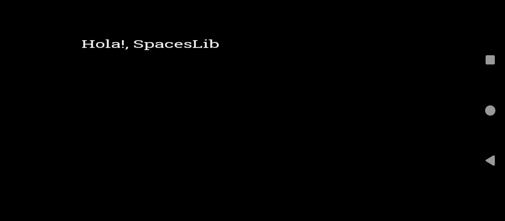

Una libreria de c++ para el Desarrollo orientado a Objetos.


# Examples

# Hello!, SpacesLib!

```c++
#include <SFML/Graphics.hpp>
#include "spaceslib.cpp"

int main(void) {
  //inciamos ventana
	init(800, 600, "pepe");

  //establecemos framerate
  setFPS(60);

    //ciclo de vida
    while (windowOpen()) {
       //bloque de codigo de vida de ventana

       WINDOW_LIFELOOP();

       //limpiamos ventana
       clear();
       //dibujamos texto
       drawText("Hola!, SpacesLib" , 100, 100, 30, default_font);

       //mostramos
       display();
    }
    //cerramos ventana
    close();
}
```

Resultado Esperado:


# Movimiento Básico

```c++
#include <SFML/Graphics.hpp>
#include <iostream>
#include "spaceslib.cpp"

int main(void) {	
	init(800, 600, "SpacesLib Test");
	setFPS(60);
	
	//creamos cuadrado
	Rect cuadrado = {
		0, //x
		0, //y
		20, //w
		20 //h
	};
	
	//creamos variable para datos(opcional)
	
	std::string datos;
	
    while (windowOpen()) {
       WINDOW_LIFELOOP();
       
       //movemos
       cuadrado.x += 1;
       cuadrado.y += 1;
       
       //actualizamos datos(opcional)
       datos = "x: " + std::to_string(cuadrado.x) + " y: " + std::to_string(cuadrado.y);
       
       clear();
       //dibujamos cuadrado
       cuadrado.draw();
       
       //dibujamos datos (opcional)
       drawText(datos, 100, 100, 30, default_font);
       display();
    }
    close();
}
```

# Instalación 

``` bash
git clone "https://github.com/christiamjhabiel/SpacesLib.git"
```

luego para compilar:

```bash
g++ main.cpp -o main -lsfml-graphics -lsfml-window -lsfml-system
```

# Tabla de Referencia

| Funcion | Que Hace | Como Usarla |
|----------|----------|----------|
| Rect    | Crear Rectangulo  | Rect cuadrado = {x, y, w, h};   |
| DrawRect    | Dibuja Rectangulo  | DrawRect(x, y, w, h);  |
| DrawText    | Dibuja Texto   | DrawText("texto", x, y, char size, font);  |
| Init | inicia Ventana | init(w, h, "titulo");|
| close | cierra Ventana | close();|

Esta tabla no siempre tendra todo ni estara actualizada asi que fijate en ejemplos.
